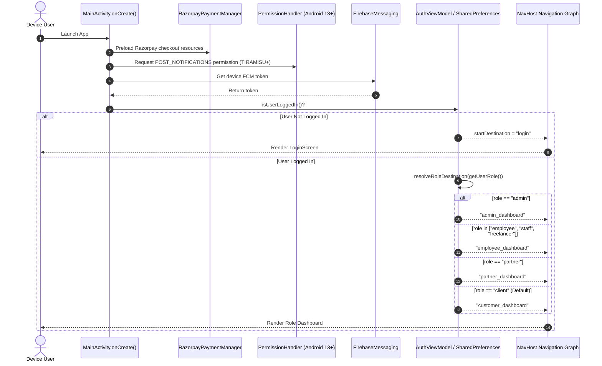

# VR HERE BMS — Complete Android Feature & Screen-by-Screen Specification

> **Document Version:** 1.0.0  
> **Target Module:** Android Application (`VRHereBMS`)  
> **Tech Stack:** Kotlin 2.0, Jetpack Compose, Material 3, Retrofit 2, OkHttp 3, Coil Compose, Razorpay SDK, Firebase Cloud Messaging (FCM), Socket.IO Client  
> **Purpose:** Exhaustive reference catalog of every screen, user flow, visual design token, state management model, and backend API integration from App Launch to Logout. This acts as the exact blueprint for replicating feature-parity in iOS (`VRHereIOS`).

---

## 1. Global Architecture & Design System Tokens

### 1.1 Color Palette & Visual Theme (`Color.kt` & `Theme.kt`)

| Token Name | Hex Code | Semantic Role & Usage |
| :--- | :--- | :--- |
| **`PrimaryRed` / `VrRed`** | `#C82323` / `#DC2626` | Brand primary color, primary CTA buttons, active state indicators |
| **`DarkRed` / `VrDarkRed`** | `#991B1B` | Gradients, top bar accents, hover/pressed state overlays |
| **`BackgroundDark`** | `#020617` / `#0F172A` | Navigation drawer, modal headers, dark contrast cards |
| **`CardBackground`** | `#FFFFFF` | Surface containers, elevated cards, bottom sheets |
| **`InputBackground`** | `#EEF2F6` / `#F8FAFC` | Form text fields, search bars, pill container fills |
| **`TextDark`** | `#1E293B` / `#0F172A` | Primary typography, card headings, numbers |
| **`TextMuted`** | `#64748B` / `#94A3B8` | Subtitles, helper labels, placeholder text, timestamps |
| **`SuccessGreen`** | `#16A34A` / `#22C55E` | "Paid" badges, positive balance, verified status |
| **`WarningAmber`** | `#F59E0B` / `#D97706` | "Pending" badges, "Under Review" status chips |
| **`InfoBlue`** | `#2563EB` / `#3B82F6` | Statutory insights category pills, info alerts |
| **`GoogleGradient`** | Multi-gradient | Border glow on Google Sign-In button (`#EA4335`, `#FBBC05`, `#34A853`, `#4285F4`) |

### 1.2 Global Elevation, Shapes & Typography

* **Shapes:** Rounded cards (`16.dp` to `24.dp`), Input fields (`12.dp`), Capsule pills (`50.dp` or `CircleShape`), Bottom Sheets (`topStart = 24.dp, topEnd = 24.dp`).
* **Typography:** System Sans-Serif font hierarchy with bold weights (`FontWeight.Bold`, `FontWeight.Black`) for numbers, headers, and CTA action titles.
* **Micro-Animations:** Tab transitions via `fadeIn() + fadeOut()`, expandable speed-dial via `slideInVertically() + fadeIn()`, pull-to-refresh indicators, pulsating unread notification badge dots.

---

## 2. App Launch & Boot Lifecycle (`MainActivity.kt`)



---

## 3. Screen-by-Screen Exhaustive Specification

---

### Screen 1: Sign In / Login (`LoginScreen.kt`)

```
+-------------------------------------------------------------+
|  [VR HERE Logo]                                            |
|                                                             |
|  Sign In                                                    |
|  Please enter your details to continue.                     |
|                                                             |
|  Email Address                                              |
|  [ (Email Icon) customer@vrhere.in                        ] |
|                                                             |
|  Password                                                   |
|  [ (Lock Icon)  ••••••••••••••••            (Eye Icon Toggle) ] |
|                                                             |
|                                      Forgot Password? [Red] |
|                                                             |
|  [ ========= Sign In -> (Red Capsule Button) ============= ]|
|                                                             |
|  ----------------------   OR   ---------------------------- |
|                                                             |
|  [ (Glowing Multi-Color Border)  G Continue with Google    ]|
|                                                             |
|  Don't have an account? Sign Up [Red Bold Link]             |
+-------------------------------------------------------------+
```

* **UI Components & Layout:**
  * Top branding: Official `VRLogoView` (36.dp height).
  * Headline: 36.sp bold "Sign In", 15.sp muted subtitle.
  * Form Fields: 2 rounded text fields (`#EEF2F6` container, transparent border):
    * Email field with `Icons.Default.Email` leading icon.
    * Password field with `Icons.Default.Lock` and visibility toggle trailing eye icon.
  * "Forgot Password?" clickable text aligned right.
  * Primary Action: Full-width red button (`#C82323`, 54.dp height, rounded 12.dp) with loading spinner or text + right arrow icon.
  * "OR" horizontal divider.
  * Social Sign-In: Elevated Google Sign-In button with 2.dp animated rainbow border gradient (`#EA4335`, `#FBBC05`, `#34A853`, `#4285F4`).
  * Bottom footer: "Don't have an account? Sign Up" link.
* **Backend API Integration:**
  * Local Login: `POST /api/auth/login` (Body: `{ email, password }`). Returns `{ _id, name, email, role, token }`.
  * Google Sign-In: `POST /api/auth/google` (Body: `{ idToken }` using Google Web Client ID `674627570227-vt8ub6924het3d49j57ep1fh6k42c9p0.apps.googleusercontent.com`).
  * Token Persistence: Stores token, role, and name in `UserPreferences` / SharedPreferences.
  * Push Token Sync: Calls `PUT /api/auth/fcm-token` (Body: `{ fcmToken }`) immediately upon auth success.
* **User Interactions & State:**
  * Error handling: Shows descriptive Toast on invalid credentials or inactive account.
  * Successful login navigates to resolved role destination and purges login from backstack (`popUpTo("login") { inclusive = true }`).

---

### Screen 2: Sign Up / Registration (`RegisterScreen.kt`)

* **UI Components & Layout:**
  * Title: "Create Account", subtitle "Start managing your business compliances today".
  * Form Fields:
    1. Full Name (`Icons.Default.Person`)
    2. Email Address (`Icons.Default.Email`)
    3. Phone Number (`Icons.Default.Phone`, Numeric keyboard)
    4. Password with visibility toggle
    5. Confirm Password with validation
    6. Referral Code (Optional, uppercase auto-formatting, with live check indicator)
  * Terms & Privacy Policy Checkbox: "I agree to the Terms of Service & Privacy Policy".
  * Primary Action: "Create Account" red button.
  * Google Sign-Up button.
  * Footer: "Already have an account? Sign In" link.
* **Backend API Integration:**
  * Validation: `GET /api/customer/referrals/validate/:code` when referral code is typed.
  * Registration: `POST /api/auth/register` (Body: `{ name, email, phone, password, referralCode }`).
  * Auto-Login: Sets JWT token on response and redirects directly to `CustomerDashboardScreen`.

---

### Screen 3: Main Dashboard Container & Navigation Shell (`CustomerDashboardScreen.kt`)

```
+-------------------------------------------------------------+
| [Menu] [VR HERE LOGO]               [Bell (2)] [Avatar]     |
+-------------------------------------------------------------+
|                                                             |
|                    < ACTIVE TAB CONTENT >                   |
|                                                             |
+-------------------------------------------------------------+
|                                              [Floating (+)] |
|                                               |-- Live Chat |
|                                               |-- WhatsApp  |
|                                               |-- Call Us   |
|                                               +-- Ticket    |
+-------------------------------------------------------------+
| [Home]    [Services]    [Orders]    [Bookkeeping]    [More] |
+-------------------------------------------------------------+
```

* **Shell Components:**
  1. **Top Navigation Bar (`VRHeader.kt`):**
     * Hamburger menu button (opens side drawer).
     * Clickable official VR HERE logo (resets tab to "Home").
     * Notification Bell with dynamic badge pill and pulsating unread dot.
     * User profile avatar image / initials circle (clicking opens "Account" tab).
  2. **Navigation Drawer (`CustomerSidebarContent.kt`):**
     * Background: Deep slate dark `#020617` with rounded 24.dp right corners.
     * Profile Header: User avatar, name, company name, role badge ("Verified Client").
     * Quick Stat Pill: Active orders count & unread alerts count.
     * Navigation Items:
       * 🏠 Home Dashboard
       * 💼 Services Catalog
       * 📦 My Orders & Projects (Badge: active count)
       * 🧾 Tax Invoices & Payments
       * 📚 GST Bookkeeping Suite
       * 🗄️ Document Vault
       * 🎁 Refer & Earn (Wallet bonus)
       * 💬 Help Desk & Support
       * 👤 Account & Profile Settings
     * Bottom item: Red Logout button with confirmation modal.
  3. **Bottom Navigation Bar (`BMSAppBottomNavBar.kt`):**
     * Fixed 5 items: **Home**, **Services**, **Orders**, **Bookkeeping**, **More** (opens bottom sheet with Vault, Referrals, Support, Account).
  4. **Floating Action Speed-Dial (Support Hub):**
     * Multi-action FAB with smooth expansion animation:
       * **Option 1 (Live Chat):** Opens native Socket.IO Live Support Dialog.
       * **Option 2 (WhatsApp):** Deep-links to `https://wa.me/918008530606` with pre-filled message.
       * **Option 3 (Direct Call):** Initiates dialer intent to `tel:+918008530606`.
       * **Option 4 (Raise Ticket):** Opens Support Tab with ticket creation sheet.
  5. **Periodic Background Polling:**
     * Silent data refresh every 15 seconds to keep orders, notifications, and invoices live.

---

### Screen 4: Tab 1 — Home Dashboard (`CustomerHomeTab.kt`)

```
+-------------------------------------------------------------+
| 👋 Welcome back, Doraswamy!                                 |
| Complete business management & legal compliances at hand.   |
|                                                             |
| [ 🔍 Search services (GST, ITR, Company, Trademark...)    ] |
|                                                             |
| +--- [FEATURED OFFERS & SCHEMES CAROUSEL] ----------------+ |
| | [Coil AsyncImage Banner with Dark Gradient Overlay]     | |
| | [LIMITED OFFER - RED BADGE]                             | |
| | Private Limited Company Incorporation                   | |
| | ₹5,000  ~~₹15,000~~ (66% OFF)                           | |
| | [Claim Offer Button]                (Carousel Dots ...) | |
| +---------------------------------------------------------+ |
|                                                             |
| +-- [QUICK STATS GRID] -----------------------------------+ |
| | [Active Orders: 3]              [Pending Due: ₹4,500]   | |
| | [Open Tickets: 1]               [Referral Wallet: ₹500] | |
| +---------------------------------------------------------+ |
|                                                             |
| +-- [QUICK ACTIONS] --------------------------------------+ |
| | [Explore Services] [New Sales Inv] [Upload Docs] [Chat] | |
| +---------------------------------------------------------+ |
|                                                             |
| 📰 REGULATORY INSIGHTS & CMS BLOGS                          |
| +---------------------------------------------------------+ |
| | [64x64 Thumbnail]  GST Filing Due Dates for Q3          | |
| | [TAXATION TAG]     5 min read • By Tax Advisory Team    | |
| +---------------------------------------------------------+ |
| | [64x64 Thumbnail]  Startup India Seed Fund Scheme 2026  | |
| | [STARTUP TAG]      7 min read • By Corporate Legal Team | |
| +---------------------------------------------------------+ |
|                                                             |
| 🚀 ACTIVE PROJECTS & ORDERS                                 |
| +---------------------------------------------------------+ |
| | ORD-2026-0042 • Private Limited Incorporation           | |
| | Status: [Under Review - Amber Chip]   Progress: [80%]   | |
| +---------------------------------------------------------+ |
+-------------------------------------------------------------+
```

* **Features & Sections:**
  1. **Greeting Header:** Dynamic greeting with user's name and subtitle.
  2. **Search Bar:** Real-time search filter across all services in the catalog.
  3. **Auto-Sliding Promotional Carousel:**
     * Fetches dynamic banners from `GET /api/offers`.
     * Renders banner image via `AsyncImage` (Coil) with `ContentScale.Crop` and dark linear gradient overlay.
     * Displays `badgeText` with dynamic `badgeColor` (e.g. `#DC2626`).
     * Displays discount pricing (`₹5,000` / `₹15,000`).
     * Auto-advances every 4 seconds or allows manual horizontal swipe.
     * Clicking "Claim Offer" deep-links to the service checkout.
  4. **Quick Stat Counters:**
     * Active Orders, Unpaid Invoices Due, Open Support Tickets, Referral Wallet Balance.
  5. **Quick Action Buttons:**
     * 1-tap shortcuts to Explore Services, Create GST Sales Invoice, Upload Documents, and Open Live Support Chat.
  6. **Regulatory Insights & Legal CMS Articles:**
     * Fetches live articles from `GET /api/blogs`.
     * Card layout with 64x64 rounded cover image thumbnail (`AsyncImage`), category pill (Taxation, Compliance, Startup), read time, and publish date.
     * **Interactive Markdown Blog Reader Sheet:**
       * Full-width header cover image.
       * Category tag, title, author, and reading time.
       * Bulleted "Key Takeaways" summary container.
       * Formatted markdown article content.
       * Native Android Share action.
  7. **Recent Orders List:**
     * Displays recent active order cards with progress bar and 1-tap navigation to the Order Details drilldown.
* **Backend API Integration:**
  * `GET /api/offers` (Active promotional schemes)
  * `GET /api/blogs` (Published legal insights)
  * `GET /api/orders` (Client active orders)
  * `GET /api/notifications` (Unread notifications count)

---

### Screen 5: Tab 2 — Services Marketplace & Checkout (`CustomerServicesTab.kt` & `CustomerServiceDetailScreen.kt`)

* **Features & Sections:**
  1. **Category Navigation:** Horizontal pill list (All, GST & Taxes, Company Registration, Accounting & Bookkeeping, Trademark & IP, Annual Compliance).
  2. **Service Cards:** Title, short description, starting price badge, feature highlights, "View Details" & "Book Now" buttons.
  3. **Native Service Detail Screen:**
     * Hero Header with service icon and category.
     * Package Comparison Tiers (Basic, Standard, Premium) with detailed feature checklists.
     * Mandatory Document Requirements checklist (e.g., PAN, Aadhaar, Bank Statement, Electricity Bill).
     * Customer Review rating breakdown.
     * Interactive FAQ Accordion with search bar.
  4. **Custom Payment Bottom Sheet (`CustomPaymentBottomSheet.kt`):**
     * Commercials summary: Base package price, 18% GST calculation, Total amount.
     * ₹499 Consultation Credit Adjustment toggle (if eligible).
     * Referral Code input with instant discount validation.
     * "Proceed to Pay" button launching native Razorpay Checkout SDK.
* **Backend API Integration:**
  * `GET /api/service-pages` (Dynamic service catalog)
  * `POST /api/payments/checkout-order` (Initializes Razorpay order)
  * `POST /api/payments/verify` (Verifies signature and creates Order in MongoDB)

---

### Screen 6: Tab 3 — My Orders & Task Engine (`CustomerOrdersTab.kt`)

* **Features & Sections:**
  1. **Status Filter Chips:** All, In Progress, Under Review, Completed, Cancelled.
  2. **Order Cards:** Order Number (`ORD-xxxx`), Service Name, Package Name, Status Chip, Assigned Staff Member avatar, and Progress Percentage.
  3. **Order Detail Bottom Sheet & Timeline:**
     * **4-Stage Stepper:**
       1. Order Placed & Payment Verified
       2. Document Verification & Maker Processing
       3. Checker Quality Audit
       4. Completed & Certificate Delivered
     * **Requirements Upload Section:**
       * Shows list of required documents with status (`Pending`, `Uploaded`, `Approved`, `Rejected`).
       * File Picker button (Camera / Gallery / PDF) to upload documents directly to `POST /api/orders/:id/requirements`.
     * **Assigned Team Member Card:** Name, designation, direct phone call / email shortcut.
     * **Download Tax Invoice:** Button opening the formal GST Tax Invoice viewer for this order.
* **Backend API Integration:**
  * `GET /api/orders` & `GET /api/orders/:id`
  * `POST /api/orders/:id/documents`
  * `POST /api/orders/:id/requirements`

---

### Screen 7: Tab 4 — Invoices & Payments Hub (`CustomerInvoicesTab.kt` & `GSTSalesInvoiceTemplateModal.kt`)

* **Features & Sections:**
  1. **Financial Overview Header:** Total Invoiced amount, Total Paid amount, Outstanding Due amount.
  2. **Invoice Cards List:**
     * Invoice Number (`INV-ddmmyyXXXX`), Service Name, Package Name, Date, Amount (INR), Status Chip (`Paid` in Green, `Sent` in Amber, `Overdue` in Red).
     * Unpaid invoices show a prominent **"Pay Now ₹X,XXX"** button triggering Razorpay SDK.
     * All invoices show a **"View GST Invoice"** button.
  3. **Standardized A4 GST Tax Invoice Viewer & PDF Generator (`InvoicePdfGenerator.kt`):**
     * Displays official entity metadata:
       * Seller: `VR HERE BUSINESS MANAGEMENT SOLUTIONS PVT LTD`
       * GSTIN: `37AAHCR7654E1Z8`
       * Place of Supply: `Andhra Pradesh (37)`
       * Bank: `HDFC Bank A/c 50200085306060, IFSC HDFC0000240`
     * Tax calculation table: Taxable Value, CGST (9%), SGST (9%) or IGST (18%), Round-Off, Final Total, Amount in Words.
     * Direct **"Share PDF"** action generating native Android PDF file using `android.graphics.pdf.PdfDocument` and opening Android share intent.
* **Backend API Integration:**
  * `GET /api/orders` (Extracts embedded `invoices[]` subdocuments)
  * `POST /api/payments/checkout-order` & `POST /api/payments/verify`

---

### Screen 8: Tab 5 — GST Bookkeeping Suite (`BookkeepingHostScreen.kt`)

The Bookkeeping suite contains 7 sub-screens accessible via a top tab bar / sub-navigation:

1. **Executive Dashboard (`ExecutiveDashboardScreen.kt`):**
   * Total Sales (₹), Total Purchases (₹), Net Profit/Loss (₹), Outstanding Receivables (₹), Outstanding Payables (₹).
   * Top 5 Customers & Top 5 Vendors summary.
   * Recent Transactions table.
2. **Sales Invoices (`SalesInvoicesScreen.kt`):**
   * List of customer sales invoices with copy type ("Original for Recipient").
   * "Create Sales Invoice" FAB opening `TransactionFormBottomSheet.kt`.
   * PDF generation & WhatsApp share.
3. **Purchase Bills (`PurchaseBillsScreen.kt`):**
   * Vendor bill recording with ITC Eligibility tags (`Inputs`, `Input Services`, `Capital Goods`, `Ineligible`).
4. **Income & Expenses (`IncomeExpensesScreen.kt`):**
   * Record operational expenses (Rent, Electricity, Travel, Office Supplies) with receipt image attachments.
5. **Party Master (`PartiesScreen.kt` & `PartyFormBottomSheet.kt`):**
   * Directory of Customers and Vendors with opening balances.
   * **Import from Android Contacts:** 1-tap `ActivityResultContracts.PickContact()` integration importing name and phone number directly into the form.
   * **Export to Phone Contacts:** 1-tap `ContactsContract.RawContacts` export.
6. **Bank Statements & Reconciliation (`BankStatementsScreen.kt` & `TagPaymentBottomSheet.kt`):**
   * Upload bank statement PDF / CSV.
   * List of unreconciled transactions.
   * 1-tap "Tag to Invoice / Party" manual reconciliation modal.
7. **Reports & Tax Exports (`ReportsScreen.kt`):**
   * Monthly GSTR-1 outward supply JSON/summary.
   * Monthly GSTR-3B tax liability matrix.
   * Tally XML voucher export for Chartered Accountants.
8. **Company Settings (`CompanySettingsBottomSheet.kt`):**
   * Configure Trade Name, Legal Name, GSTIN, PAN, Bank Details, Default Terms & Conditions.

* **Backend API Integration:**
  * `GET/POST/PUT/DELETE /api/accounting/transactions`
  * `GET/POST/PUT/DELETE /api/accounting/parties`
  * `GET/POST/DELETE /api/accounting/bank-statements`
  * `GET/POST /api/accounting/company`
  * `GET /api/accounting/export/gstr1` & `/gstr3b` & `/tally`

---

### Screen 9: Tab 6 — Document Vault (`CustomerVaultTab.kt`)

* **Features & Sections:**
  1. **Folder Grid:**
     * 📁 Company Incorporation & MOA/AOA
     * 📁 GST Registration Certificates
     * 📁 Income Tax Returns & Form 26AS / AIS
     * 📁 PAN, Aadhaar & KYC Records
     * 📁 Financial Statements & Audit Reports
  2. **Document List:** File name, file size, upload date, verification status pill (`Verified` in green, `Under Review` in amber).
  3. **Upload Floating Button:** Opens camera, gallery, or PDF picker and uploads document to `POST /api/documents/upload`.
  4. **Document Viewer & Downloader:** Tapping any document opens native preview or downloads the file to local storage.
* **Backend API Integration:**
  * `GET /api/documents`
  * `POST /api/documents/upload`
  * `DELETE /api/documents/:id`

---

### Screen 10: Tab 7 — Refer & Earn / Affiliate Wallet (`CustomerReferralTab.kt`)

* **Features & Sections:**
  1. **Referral Hero Card:**
     * Displays user's unique referral code (e.g. `VRHERERAJU`).
     * 1-tap **"Copy Code"** button (copies to clipboard with haptic feedback).
     * 1-tap **"Share Link"** button opening social share sheet with custom message.
  2. **Wallet Balance Card:**
     * Current withdrawable balance: `₹1,500`.
     * **"Request UPI Payout"** button opening UPI dialog.
  3. **UPI Payout Modal:**
     * Input field for UPI ID (e.g. `user@okhdfcbank` or mobile UPI).
     * Validates UPI format and submits payout request.
  4. **Referral Performance Stats:**
     * Total Friends Referred, Successfully Converted Clients, Total Bonus Earned, Pending Approvals.
  5. **Referral Activity Log:** List of referred contacts and reward milestone statuses.
* **Backend API Integration:**
  * `GET /api/customer/referrals/stats`
  * `POST /api/customer/referrals/payout-request` (Body: `{ upiId, amount }`)
  * `POST /api/customer/referrals/lead` (Body: `{ friendName, friendEmail, friendPhone }`)

---

### Screen 11: Tab 8 — Help Desk, Tickets & Live Support (`CustomerSupportTab.kt` & `LetsTrackChatDialog.kt`)

* **Features & Sections:**
  1. **Support Channels Header:**
     * Instant Live Chat (Socket.IO engine)
     * WhatsApp Business Chat (`+918008530606`)
     * Phone Support (`1800-XXX-XXXX` / `+918008530606`)
     * Email Support (`support@vrhere.in`)
  2. **My Support Tickets List:**
     * Ticket ID (`TCK-1042`), Subject, Category (`Technical`, `Service`, `Billing`, `Support`), Priority (`Low`, `Medium`, `High`, `Urgent`), Status (`Open`, `In Progress`, `Resolved`).
     * Unread agent message counter.
  3. **Raise Ticket Bottom Sheet:**
     * Subject, Category dropdown, Priority dropdown, Detailed Description, Attachment picker.
  4. **Interactive Ticket Message Thread:**
     * Chat-like interface displaying history between user and support agents with timestamps and attachments.
     * Text input bar with send button.
  5. **Native Socket.IO Live Chat Dialog (`LetsTrackChatDialog.kt`):**
     * Direct real-time WebSocket connection to `https://livechat.vrhere.in/visitor`.
     * Tenant ID: `lt_6a9347d5410be8335e42db43949caf95`.
     * Full visitor session handshake: creates visitor ID, joins live queue, exchanges real-time messages with typing indicators and audio alerts.
* **Backend API Integration:**
  * `GET /api/tickets`
  * `POST /api/tickets`
  * `POST /api/tickets/:id/messages`
  * Socket.IO Livechat Gateway (`wss://livechat.vrhere.in`)

---

### Screen 12: Tab 9 — Account Profile & Settings (`CustomerAccountTab.kt`)

* **Features & Sections:**
  1. **Profile Header Card:**
     * User avatar with camera upload icon.
     * User Full Name, Email, Phone, Role Badge.
  2. **Business Information Form:**
     * Company Legal Name, Trade Name, Business Type (Pvt Ltd, LLP, Prop, Partnership), GSTIN, PAN, Registered Business Address.
  3. **Bank & Payout Details:**
     * Account Holder Name, Bank Account Number, IFSC Code, Bank Name, Saved UPI ID.
  4. **Security & App Preferences:**
     * Change Password modal.
     * Push Notification toggle.
  5. **Danger Zone:**
     * "Delete Account" red button with warning confirmation dialog.
  6. **Logout Button:**
     * Displays confirmation dialog ("Are you sure you want to log out?").
     * Clears all tokens, cached session data, and resets navigation to `LoginScreen`.
* **Backend API Integration:**
  * `GET /api/auth/profile`
  * `PUT /api/auth/profile`
  * `POST /api/auth/upload-avatar`
  * `POST /api/auth/upload-logo`
  * `DELETE /api/auth/delete-account`

---

## 4. Cross-Platform Parity Summary Matrix for iOS (Phase 3)

| Android Screen / Feature | Jetpack Compose Architecture | Proposed iOS SwiftUI Equivalent |
| :--- | :--- | :--- |
| **Authentication & Google** | `LoginScreen.kt` + Google Play Services | `LoginView.swift` + `GoogleSignIn` SDK |
| **Navigation Shell** | `ModalNavigationDrawer` + `Scaffold` | `NavigationSplitView` / `TabView` + Custom Drawer |
| **Featured Offers Carousel** | `HorizontalPager` + `AsyncImage` (Coil) | `TabView(.page)` + `AsyncImage` / Kingfisher |
| **CMS Blog Reader** | `CustomerHomeTab.kt` ModalBottomSheet | `BlogDetailSheet.swift` with MarkdownText |
| **Service Catalog & Detail** | `CustomerServicesTab.kt` + Accordion | `ServicesCatalogView.swift` + `DisclosureGroup` |
| **Razorpay Payments** | `RazorpayPaymentManager.kt` Native SDK | `Razorpay` iOS Framework (`RazorpayPaymentCompletionProtocol`) |
| **Orders & 4-Stage Timeline**| `CustomerOrdersTab.kt` Stepper | `OrdersTimelineView.swift` Custom Stepper |
| **GST PDF Invoice Generator** | `InvoicePdfGenerator.kt` (Android PDF) | `PDFKit` / `UIGraphicsPDFRenderer` |
| **Bookkeeping Hub & Ledger** | `BookkeepingHostScreen.kt` | `BookkeepingHubView.swift` |
| **Contacts Sync (Import/Export)**| `PickContact()` / `ContactsContract` | `CNContactPickerViewController` / `CNContactStore` |
| **Live Support Chat** | `LetsTrackChatDialog.kt` (Socket.IO) | `LiveChatSocketView.swift` (`SocketIO-Client-Swift`) |
| **Document Vault** | `CustomerVaultTab.kt` | `DocumentVaultView.swift` + `fileImporter` |
| **Refer & Earn Wallet** | `CustomerReferralTab.kt` + UPI Sheet | `ReferralWalletView.swift` + UPI Share Sheet |
| **Profile & Settings** | `CustomerAccountTab.kt` | `ProfileSettingsView.swift` |
