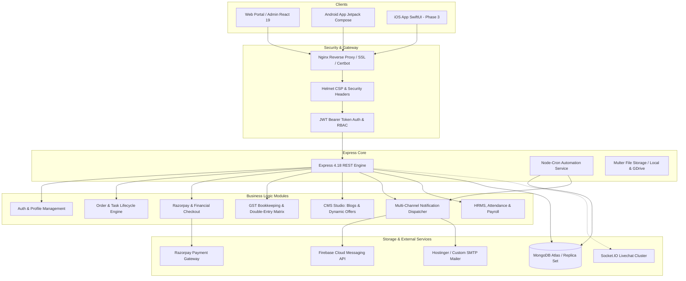
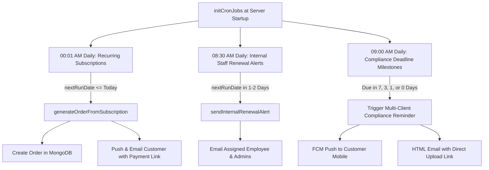

# VR HERE Business Management Solutions — Backend Architecture & API Specification

> **Document Version:** 1.0.0  
> **Last Updated:** October 2026  
> **Environment:** Node.js (ESM), Express.js, MongoDB (Mongoose), Razorpay, Firebase Admin, Nodemailer, node-cron  
> **Production Server:** `147.93.107.21` (Reverse-proxied via Nginx on port `5002`)

---

## 1. Executive System Architecture

VR HERE operates an enterprise-grade, multi-tenant capable Backend REST API and asynchronous job engine powering the Web Admin/Client Portals, Android Application (`VRHereBMS`), and upcoming iOS Application (`VRHereIOS`).



---

## 2. Infrastructure & Environment Configuration

### 2.1 Technology Stack

| Component | Technology | Description |
| :--- | :--- | :--- |
| **Runtime** | Node.js v20+ (ES Modules `"type": "module"`) | High-performance asynchronous execution |
| **Framework** | Express.js 4.18.2 | HTTP routing, middleware pipeline |
| **Database** | MongoDB 7.0+ via Mongoose 8.0.3 | Document database with schema enforcement |
| **Payments** | Razorpay SDK 2.9.6 | Order creation, payment links, webhooks, signature verification |
| **Push Notifications**| Firebase Admin SDK 12.0.0 | High-priority FCM push to mobile devices |
| **Email Service** | Nodemailer 7.0.13 | Transporter sending branded HTML transactional emails |
| **Cron Scheduling** | node-cron 4.2.1 | Scheduled daily automation, renewals & compliance alerts |
| **Security** | Helmet 7.1.0, CORS, Bcryptjs 2.4.3 | CSP policies, origin control, password hashing |
| **Process Manager** | PM2 | Daemon process management (`vrhere-api`) |

### 2.2 Core Environment Variables (`.env`)

| Variable | Description |
| :--- | :--- |
| `PORT` | Local binding port (default: `5002`) |
| `NODE_ENV` | Running mode (`development` or `production`) |
| `MONGO_URI` | MongoDB connection URI string with authentication |
| `JWT_SECRET` | 256-bit secret key used to sign and verify JSON Web Tokens |
| `RAZORPAY_KEY_ID` | Public Key ID for Razorpay checkout integration |
| `RAZORPAY_KEY_SECRET` | Private Secret Key for webhook and signature verification |
| `SMTP_HOST` | Outgoing SMTP host server (e.g., `smtp.hostinger.com`) |
| `SMTP_PORT` | SMTP port (`465` for SSL, `587` for TLS) |
| `SMTP_USER` / `SMTP_PASS` | Authenticated email credentials |
| `FIREBASE_SERVICE_ACCOUNT` | Path or JSON payload for Firebase Admin SDK service account |
| `CLIENT_URL` | Base public URL for client dashboard (e.g., `https://vrhere.in`) |

---

## 3. Authentication, Authorization & RBAC Pipeline

### 3.1 Role Hierarchy

The backend implements 5 distinct user roles:

1. **`admin`**: Unrestricted access across all operational modules, financials, CMS studio, employee timesheets, and system configurations.
2. **`employee`** (`staff` middleware): Staff member assigned to tasks, attendance logging, compliance filings, and client order fulfillment.
3. **`client`**: Standard customer access. Can manage own orders, raise support tickets, create bookkeeping invoices/parties, view GST documents, and redeem referral bonuses.
4. **`partner`**: Channel affiliate partner with commission tracking, referral payouts, and lead management.
5. **`freelancer`**: Independent contractor with task assignment, hourly timesheets, and milestone payouts.

### 3.2 Authentication Middleware Flow

```mermaid
sequenceDiagram
    autonumber
    actor Client as Mobile / Web Client
    participant AuthMW as authMiddleware (protect)
    participant JWT as jsonwebtoken.verify()
    participant DB as MongoDB User Model
    participant Route as Controller Handler

    Client->>AuthMW: HTTP Request + Bearer <JWT_TOKEN>
    alt Token Missing
        AuthMW-->>Client: 401 Unauthorized ("Not authorized, no token")
    else Token Present
        AuthMW->>JWT: Decode token with JWT_SECRET
        alt Token Expired or Invalid Signature
            JWT-->>Client: 401 Unauthorized ("Not authorized, token failed")
        else Token Valid
            AuthMW->>DB: User.findById(decoded.id).select('-password')
            alt User Not Found or isActive === false
                AuthMW-->>Client: 403 Forbidden ("User account is inactive")
            else User Active
                AuthMW->>Route: req.user = userDoc; next()
                Route-->>Client: 200 OK + Data Payload
            end
        end
    end
```

### 3.3 Middleware Functions (`backend/middleware/authMiddleware.js`)

* `protect`: Requires valid Bearer token and active user status.
* `protectOptional`: Decodes token if present to attach `req.user`, but allows unauthenticated guest requests (used for public checkouts and telemetry lead tracking).
* `admin`: Restricts route strictly to `req.user.role === 'admin'`.
* `staff`: Restricts route to `req.user.role === 'admin'` or `'employee'`.
* `canManageCompliance`: Restricts route to `req.user.role === 'admin'` or `req.user.canManageCompliance === true`.

---

## 4. Complete Database Schema Models Reference

The backend operates 32 Mongoose models under `backend/models/`:

### 4.1 Core Entities

#### 1. `User.js`
* **Identity**: `name`, `email` (unique), `password` (hashed with bcrypt), `googleId` (sparse), `authProvider` (`'local' | 'google'`), `phone`, `profilePhoto`, `companyLogo`.
* **Business Profile**: `companyName`, `businessType`, `gstin`, `panNumber`, `address`.
* **Roles & Permissions**: `role` (`'admin' | 'employee' | 'client' | 'partner' | 'freelancer'`), `canManageCompliance` (boolean), `isActive` (boolean).
* **HRMS / Employee Details**: `assignedTicketCategories`, `skills`, `yearsOfExperience`, `resumeUrl`, `isClockedIn`, `lastClockInTime`, `activeOrderId`.
* **Bank & Commission**: `commissionPercentage`, `bankDetails: { accountName, accountNumber, ifscCode, bankName }`, `walletBalance`, `savedUpiId`.
* **Referrals & Notifications**: `referralCode` (unique, uppercase), `referredBy` (`User` ref), `fcmToken` (push notification token).

#### 2. `Order.js`
* **Service Context**: `serviceName`, `packageName`, `orderNumber`, `clientName`, `email`, `phone`, `user` (`User` ref), `assignedEmployee` (`User` ref), `status` (`'Pending' | 'In Progress' | 'Under Review' | 'Completed' | 'Cancelled'`).
* **Workflow Audit**: `assignedMaker` (`User` ref), `assignedChecker` (`User` ref), `checkerStatus` (`'Pending' | 'Approved' | 'Rejected'`), `checkerAuditNotes`, `submittedToCheckerAt`.
* **Commercials**: `basePrice`, `discount`, `tax`, `totalAmount`, `paymentStatus` (`'Unpaid' | 'Partially Paid' | 'Paid'`), `consultationAdjusted` (boolean).
* **Embedded Subdocuments**:
  * `invoices[]`: `{ invoiceNumber, amount, status, url, dueDate, notes, sentAt, createdAt }`
  * `tasks[]`: `{ title, description, status, assignedTo, dueDate, subtasks[], timeLogs[] }`
  * `requirements[]`: `{ label, type, isRequired, isUploaded, fileUrl, comments, uploadedAt }`
  * `checklists[]`: `{ title, isCompleted, completedAt, completedBy }`
  * `documents[]`: `{ name, fileUrl, uploadedBy, uploadedAt }`

#### 3. `Transaction.js` (GST Bookkeeping Master)
* **Categorization**: `clientUser` (`User` ref), `transactionType` (`'Sales' | 'Purchase' | 'Income' | 'Expense' | 'CreditNote' | 'DebitNote'`), `copyType` (`'Original for Recipient' | 'Duplicate for Supplier' | 'Triplicate for Transporter'`).
* **Document Info**: `docNumber`, `docDate`, `dueDate`, `paymentMode` (`'Cash' | 'Bank Transfer' | 'UPI' | 'Cheque' | 'Credit'`).
* **Party (Bill To)**: `partyName`, `partyGstin`, `partyPan`, `partyAddress`, `partyState`, `partyPhone`, `partyEmail`, `placeOfSupply`, `isInterstate` (boolean).
* **Ship To (Consignee)**: `shipToSameAsBilling`, `shipToName`, `shipToAddress`, `shipToGstin`, `shipToPan`, `shipToState`, `shipToMobile`, `shipToEmail`.
* **Line Items**: Array of `{ description, hsnSac, qty, unit, rate, discPercent, taxableValue, gstRate, cgst, sgst, igst, total }`.
* **Financial Summary**: `{ totalTaxableValue, totalCgst, totalSgst, totalIgst, roundOff, totalAmount, amountInWords }`.
* **Status**: `itcEligibility` (`'Inputs' | 'Input Services' | 'Capital Goods' | 'Ineligible' | 'N/A'`), `paymentStatus` (`'Unpaid' | 'Partially Paid' | 'Paid'`), `status` (`'Draft' | 'Recorded' | 'Verified' | 'Flagged'`).

#### 4. `Party.js` (Customer / Vendor Directory)
* `clientUser` (`User` ref), `name`, `type` (`'Customer' | 'Vendor' | 'Both'`), `phone`, `email`, `gstin`, `pan`, `address`, `state`, `pincode`, `openingBalance`, `balanceType` (`'To Receive' | 'To Pay'`), `bankDetails`.

#### 5. `Blog.js` (Regulatory Insights CMS)
* `title`, `slug` (unique indexed), `category` (`'Taxation' | 'Compliance' | 'Corporate Law' | 'Startup' | 'GST' | 'Finance' | 'General'`), `summary`, `content` (Markdown), `coverImage`, `author`, `readTime`, `tags` (array), `keyTakeaways` (array of strings), `isPublished` (boolean), `publishedAt`.

#### 6. `Offer.js` (Promotions & Scheme Banners)
* `title`, `description`, `bannerImage`, `badgeText`, `badgeColor` (Hex code, e.g. `#DC2626`), `originalPrice`, `discountedPrice`, `discountAmount`, `targetServiceSlug`, `ctaText`, `isActive` (boolean), `displayOrder` (number), `validUntil` (Date).

#### 7. `RecurringService.js` & `Compliance.js`
* `RecurringService`: Subscriptions with billing cycles (`'Monthly' | 'Quarterly' | 'Yearly'`), `nextRunDate`, `renewalPrice`, `assignedEmployee`, `autoGenerateOrder` (boolean).
* `Compliance`: Regulatory statutory deadlines with `category` (`'GST' | 'TDS' | 'Income Tax' | 'MCA / ROC' | 'Payroll'`), `taskName`, `dueDate`, `periodMonth`, `periodYear`, `status` (`'Pending' | 'Filed' | 'Overdue'`).

#### 8. `Ticket.js` & `Lead.js`
* `Ticket`: Help desk tickets with category, priority, status, assigned agent, and threaded `messages[]` with attachments.
* `Lead`: Inbound leads & telemetry tracking with `platform` (`'web' | 'android' | 'ios'`), `serviceOfInterest`, `utmSource`, `leadScore`, and conversion status.

---

## 5. Complete REST API Route Catalog & Endpoints Matrix

### 5.1 Authentication & User Management (`/api/auth`)

| Method | Endpoint | Access | Description |
| :--- | :--- | :--- | :--- |
| `POST` | `/api/auth/register` | Public | Register new client account |
| `POST` | `/api/auth/register-partner` | Public | Register affiliate partner account |
| `POST` | `/api/auth/login` | Public | Authenticate with email & password, returns JWT |
| `POST` | `/api/auth/google` | Public | Authenticate via Google ID Token |
| `POST` | `/api/auth/forgotpassword` | Public | Send password reset token email |
| `PUT` | `/api/auth/resetpassword/:resetToken` | Public | Reset password using token |
| `GET` | `/api/auth/profile` | `protect` | Get current logged-in user profile |
| `PUT` | `/api/auth/profile` | `protect` | Update profile information & company details |
| `POST` | `/api/auth/upload-avatar` | `protect` | Upload profile photo (Multer) |
| `POST` | `/api/auth/upload-logo` | `protect` | Upload company logo (Multer) |
| `PUT` | `/api/auth/fcm-token` | `protect` | Register or update device FCM token for push |
| `DELETE` | `/api/auth/delete-account` | `protect` | Self-service account deletion |
| `GET` | `/api/auth/employees` | `protect, admin` | List all employee/staff records |
| `GET` | `/api/auth/users` | `protect, admin` | Paginated user management table |
| `POST` | `/api/auth/users` | `protect, admin` | Admin create user account |
| `PUT` | `/api/auth/users/:id` | `protect, admin` | Admin update user account & permissions |
| `DELETE` | `/api/auth/users/:id` | `protect, admin` | Admin delete user |
| `PATCH` | `/api/auth/users/:id/toggle-active` | `protect, admin` | Toggle user active / disabled status |
| `POST` | `/api/auth/users/:id/send-password-link`| `protect, admin` | Admin generate and send set-password link |

---

### 5.2 Content Management Studio (`/api/blogs` & `/api/offers`)

| Method | Endpoint | Access | Description |
| :--- | :--- | :--- | :--- |
| `GET` | `/api/blogs` | Public | List published regulatory insights (supports `?category=`) |
| `GET` | `/api/blogs/:slug` | Public | Retrieve single blog post by slug |
| `GET` | `/api/blogs/admin/all` | `protect, admin` | List all blogs (including drafts) for CMS Studio |
| `POST` | `/api/blogs` | `protect, admin` | Create blog post (supports key takeaways & markdown) |
| `PUT` | `/api/blogs/:id` | `protect, admin` | Update blog post |
| `DELETE` | `/api/blogs/:id` | `protect, admin` | Delete blog post |
| `GET` | `/api/offers` | Public | List active promotional offers & banners |
| `GET` | `/api/offers/admin/all` | `protect, admin` | List all offers for Admin CMS Studio |
| `POST` | `/api/offers` | `protect, admin` | Create promotional offer banner with prices |
| `PUT` | `/api/offers/:id` | `protect, admin` | Update offer banner details |
| `DELETE` | `/api/offers/:id` | `protect, admin` | Delete offer banner |

---

### 5.3 Order Management & Task Engine (`/api/orders`)

| Method | Endpoint | Access | Description |
| :--- | :--- | :--- | :--- |
| `POST` | `/api/orders` | `protect` | Create new client service order |
| `GET` | `/api/orders` | `protect` | Fetch orders (filtered by client or all for staff/admin) |
| `GET` | `/api/orders/:id` | `protect` | Get order details with invoices, tasks, requirements |
| `PUT` | `/api/orders/:id` | `protect, admin` | Admin update order metadata |
| `DELETE` | `/api/orders/:id` | `protect, admin` | Admin delete order |
| `PUT` | `/api/orders/:id/status` | `protect` | Update order progress status |
| `PUT` | `/api/orders/:id/assign` | `protect` | Assign order to staff member |
| `POST` | `/api/orders/:id/submit-to-checker` | `protect` | Maker submits order to assigned Checker for audit |
| `POST` | `/api/orders/:id/checker-audit` | `protect` | Checker approves or rejects order with audit notes |
| `PUT` | `/api/orders/:id/commercials` | `protect, admin` | Update order pricing, discounts & tax breakdown |
| `POST` | `/api/orders/:id/documents` | `protect` | Upload document to order |
| `POST` | `/api/orders/:id/tasks` | `protect` | Add task item to order |
| `PUT` | `/api/orders/:id/tasks/:taskId` | `protect` | Update task status |
| `POST` | `/api/orders/:id/tasks/:taskId/time-log` | `protect` | Log staff hours against task |
| `POST` | `/api/orders/:id/invoices` | `protect, admin` | Generate formal invoice & Razorpay link |
| `POST` | `/api/orders/:id/invoices/adjusted` | `protect, admin` | Create milestone or consultation-adjusted invoice |
| `PUT` | `/api/orders/:id/invoices/:invoiceId/status`| `protect, admin` | Update payment status of invoice |
| `POST` | `/api/orders/:id/requirements` | `protect` | Add requirement or upload client document |
| `PUT` | `/api/orders/:id/requirements/:reqId` | `protect` | Update requirement status / comments |

---

### 5.4 Bookkeeping, GST Invoicing & Accounting (`/api/accounting`)

| Method | Endpoint | Access | Description |
| :--- | :--- | :--- | :--- |
| `POST` | `/api/accounting/transactions` | `protect` | Create Sales/Purchase/Expense transaction |
| `GET` | `/api/accounting/transactions` | `protect` | Fetch transactions with filters (`type`, `month`, `party`) |
| `PUT` | `/api/accounting/transactions/:id` | `protect` | Update transaction record |
| `DELETE` | `/api/accounting/transactions/:id` | `protect` | Delete transaction record |
| `POST` | `/api/accounting/transactions/:id/payment`| `protect` | Record payment against invoice |
| `GET` | `/api/accounting/company` | `protect` | Get client business & GST profile |
| `POST` | `/api/accounting/company` | `protect` | Upsert client business profile |
| `GET` | `/api/accounting/parties` | `protect` | Get customer/vendor party directory |
| `POST` | `/api/accounting/parties` | `protect` | Create new party (customer/vendor) |
| `PUT` | `/api/accounting/parties/:id` | `protect` | Update party details |
| `DELETE` | `/api/accounting/parties/:id` | `protect` | Delete party |
| `GET` | `/api/accounting/bank-statements` | `protect` | Get uploaded bank statements |
| `POST` | `/api/accounting/bank-statements` | `protect` | Upload & parse bank statement |
| `POST` | `/api/accounting/bank-statements/:id/tag` | `protect` | Tag statement transaction to ledger account |
| `GET` | `/api/accounting/payroll` | `protect` | Get monthly employee payroll records |
| `POST` | `/api/accounting/payroll` | `protect` | Record payroll with TDS deduction |
| `GET` | `/api/accounting/export/tally` | `protect` | Export Tally XML / JSON vouchers |
| `GET` | `/api/accounting/export/gstr1` | `protect` | Generate GSTR-1 statutory summary |
| `GET` | `/api/accounting/export/gstr3b` | `protect` | Generate GSTR-3B tax liability matrix |
| `GET` | `/api/accounting/filings/matrix` | `protect` | Admin monthly filing sign-off matrix |

---

### 5.5 Payments & Checkout Engine (`/api/payments`)

| Method | Endpoint | Access | Description |
| :--- | :--- | :--- | :--- |
| `POST` | `/api/payments/checkout-order` | `protectOptional` | Initialize Razorpay checkout order |
| `POST` | `/api/payments/verify` | `protectOptional` | Verify HMAC SHA256 signature, provision user & order |
| `POST` | `/api/payments/razorpay/webhook` | Public | Razorpay webhook callback for captured payments |
| `GET` | `/api/payments` | `protect` | Fetch payment transaction records |
| `GET` | `/api/payments/:id` | `protect` | Get single payment record |

---

### 5.6 Customer Referral Engine (`/api/customer/referrals`)

| Method | Endpoint | Access | Description |
| :--- | :--- | :--- | :--- |
| `GET` | `/api/customer/referrals/validate/:code` | Public | Validate referral code before checkout |
| `GET` | `/api/customer/referrals/stats` | `protect` | Get referral wallet balance & conversion counts |
| `POST` | `/api/customer/referrals/lead` | `protect` | Client refers a new friend/contact |
| `POST` | `/api/customer/referrals/payout-request` | `protect` | Request UPI wallet balance payout |
| `GET` | `/api/customer/referrals/admin/all` | `protect, admin` | Admin overview of all affiliate referrals & payouts |

---

### 5.7 Statutory Compliance & Deadlines (`/api/compliance`)

| Method | Endpoint | Access | Description |
| :--- | :--- | :--- | :--- |
| `GET` | `/api/compliance` | `canManageCompliance` | Get compliance filing records |
| `POST` | `/api/compliance` | `canManageCompliance` | Create single compliance calendar entry |
| `POST` | `/api/compliance/bulk-generate` | `canManageCompliance` | Bulk-generate yearly compliance deadlines for clients |
| `PUT` | `/api/compliance/:id` | `canManageCompliance` | Update filing status / mark completed |
| `DELETE` | `/api/compliance/:id` | `canManageCompliance` | Delete compliance record |

---

### 5.8 HRMS, Attendance, Timesheets & Leaves (`/api/hrms`, `/api/attendance`, `/api/timesheets`)

| Method | Endpoint | Access | Description |
| :--- | :--- | :--- | :--- |
| `POST` | `/api/attendance/clock-in` | `protect` | Staff clock-in with geo-location & IP |
| `POST` | `/api/attendance/clock-out` | `protect` | Staff clock-out with duration summary |
| `GET` | `/api/attendance/my` | `protect` | Get staff own monthly attendance records |
| `GET` | `/api/attendance/admin/today` | `protect, admin` | Live dashboard of who is currently working |
| `POST` | `/api/timesheets` | `protect` | Log work hours against client orders |
| `GET` | `/api/timesheets/my` | `protect` | View logged timesheet records |
| `POST` | `/api/hrms/leaves` | `protect` | Apply for casual/sick/earned leave |
| `GET` | `/api/hrms/leaves/my` | `protect` | View own leave applications |
| `GET` | `/api/hrms/leaves/admin` | `protect, admin` | Admin leave approval queue |
| `PUT` | `/api/hrms/leaves/:id/approve` | `protect, admin` | Approve / Reject leave application |
| `POST` | `/api/hrms/holidays` | `protect, admin` | Add official company holiday |
| `GET` | `/api/hrms/holidays` | `protect` | List company calendar holidays |
| `POST` | `/api/hrms/notices` | `protect, admin` | Broadcast company bulletin notice |
| `GET` | `/api/hrms/notices` | `protect` | List company notices |

---

## 6. Financial Calculations & Business Logic Rules

### 6.1 Standardized Seller Information

The seller entity details are uniform across all platforms (Web, Android, iOS):

* **Company Name:** `VR HERE BUSINESS MANAGEMENT SOLUTIONS PVT LTD`
* **Address:** `Flat No. 302, Sri Sai Nilayam, Beside HDFC Bank, Main Road, Gajuwaka, Visakhapatnam - 530026`
* **GSTIN:** `37AAHCR7654E1Z8`
* **PAN:** `AAHCR7654E`
* **Place of Supply (Home State):** `Andhra Pradesh (Code: 37)`
* **Primary Bank Account:** `HDFC Bank`
* **Account Number:** `50200085306060`
* **IFSC Code:** `HDFC0000240`
* **Branch:** `Gajuwaka, Visakhapatnam`

### 6.2 GST Tax Calculation Rules

```
Intra-State Supply (Place of Supply state code === "37"):
    CGST Rate = GST Rate / 2 (e.g. 9%)
    SGST Rate = GST Rate / 2 (e.g. 9%)
    IGST Rate = 0%
    CGST Amount = Taxable Value * (CGST Rate / 100)
    SGST Amount = Taxable Value * (SGST Rate / 100)
    IGST Amount = 0

Inter-State Supply (Place of Supply state code !== "37"):
    CGST Rate = 0%
    SGST Rate = 0%
    IGST Rate = GST Rate (e.g. 18%)
    CGST Amount = 0
    SGST Amount = 0
    IGST Amount = Taxable Value * (IGST Rate / 100)

Total Invoice Amount:
    Subtotal = Total Taxable Value + Total CGST + Total SGST + Total IGST
    Round-Off = Math.round(Subtotal) - Subtotal
    Final Amount = Subtotal + Round-Off
```

### 6.3 Invoice Number Generation Standard

Invoices generated by the backend follow the strict sequence format:
$$\text{INV-ddmmyyXXXX}$$
* `ddmmyy`: Date formatted in Indian Standard Time (IST, UTC+5:30)
* `XXXX`: 4-digit zero-padded sequential integer (e.g., `0001`, `0002`)
* Split Milestone 2 invoices append `_BAL` (e.g., `INV-0210260001_BAL`).

### 6.4 Consultation Adjustment & Milestone Invoicing Rules

* **Consultation Credit:** When a client pays a ₹499 initial consultation and proceeds to a full package, selecting `adjustConsultation = true` deducts exactly ₹499 from the base invoice amount and sets `order.consultationAdjusted = true`.
* **Milestone Split:** When split invoicing is activated (e.g. 50%), the first invoice is created with status `'Sent'` and a direct Razorpay payment link. The remaining balance invoice is generated with status `'Draft'` and suffix `_BAL`.

---

## 7. Asynchronous Jobs & Multi-Channel Notifications

### 7.1 Scheduled Cron Engine (`backend/services/cronService.js`)



### 7.2 Multi-Channel Notification Pipeline

When `triggerNotification({ userId, title, message, type, emailOpts })` is invoked:
1. **In-App Record:** Inserts a document into `notifications` collection in MongoDB.
2. **Push Notification:** Fetches user's `fcmToken` and calls `sendPushNotification()` via Firebase Admin SDK with high priority payload.
3. **Transactional Email:** If `emailOpts.send` is true and user has a valid email, renders responsive branded HTML and dispatches via Nodemailer SMTP.

---

## 8. Cross-Platform Guidelines for iOS Replication (Phase 3 Preparation)

When building the native iOS app (`VRHereIOS`):

1. **Networking Layer:**
   * Base URL: `https://vrhere.in` (or local dev proxy `http://<IP>:5002`).
   * Headers: `Authorization: Bearer <JWT_TOKEN>`, `Content-Type: application/json`.
   * Secure Storage: Store JWT token securely in iOS **Keychain Services** (avoid UserDefaults for sensitive tokens).

2. **Codable Models:**
   * Mirror Mongoose schemas: `BlogResponse`, `OfferResponse`, `TransactionResponse`, `PartyResponse`, `OrderResponse`, `UserResponse`.

3. **Media & Image Loading:**
   * Use `AsyncImage` or `Kingfisher` with caching and dark gradient overlays for promotional offer carousel banners and blog thumbnails.

4. **Apple Contacts Framework:**
   * Import contacts: `CNContactPickerViewController` to quickly populate `Party` forms.
   * Export parties: `CNContactStore` to save VR HERE business contacts to the user's iOS address book.

5. **PDF Tax Invoices:**
   * Use `PDFKit` / `UIGraphicsPDFRenderer` replicating the standard A4 GST layout and `VR HERE BUSINESS MANAGEMENT SOLUTIONS PVT LTD` seller metadata.

6. **Live Support Hub:**
   * Socket.IO Swift client connecting to `https://livechat.vrhere.in/visitor` (Tenant ID: `lt_6a9347d5410be8335e42db43949caf95`).

---

## 9. Verification & VPS Maintenance Runbook

To pull latest backend changes on the live VPS:

```bash
cd /var/www/vrhere
git reset --hard HEAD
git checkout .
git clean -fd
git pull origin main
cd backend
npm install
pm2 restart vrhere-api --update-env
pm2 save
```

To view live application logs:
```bash
pm2 logs vrhere-api --lines 100
```
