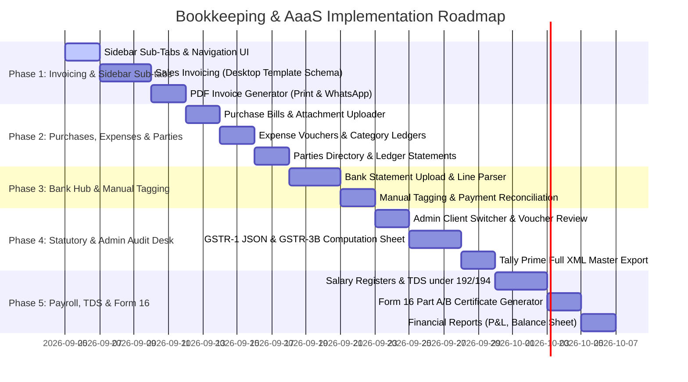

# 📊 Bookkeeping & AaaS (Accounting as a Service) — Comprehensive Implementation Plan

## 1. Executive Overview & Scope

The **Bookkeeping & AaaS** module is a core recurring service offering on **VR Here**. It serves two primary user groups:
1. **Clients (Entrepreneurs & Businesses)**: To seamlessly generate GST-compliant sales invoices, log/upload purchase bills, track business income/expenses, upload bank statements, and tag payments against sales/purchases to manage their day-to-day operations effortlessly.
2. **Admin / CA / Staff / Freelancers**: To audit client transactional data, review ledgers and vouchers, export data into accounting software (Tally Prime / Zoho Books), prepare statutory filings (**GSTR-1 JSON, GSTR-3B summary, GSTR-2B ITC verification**), run payroll, compute TDS, and generate **Form 16**.

> [!NOTE]
> Per requirement:
> 1. **No Automatic Matching System**: Bank reconciliation will be manual/assisted tagging without automated heuristic matching.
> 2. **Sidebar Inner Sub-Tabs**: Bookkeeping will feature clear, organized inner tabs in the sidebar for both Customer and Admin/Staff suites.
> 3. **Exact Sales Invoice Template**: The Sales Invoice generator & PDF renderer will adhere strictly to the **`SALES INVOICE TEMPLATE.xlsx`** standard.

---

## 2. Inner Sidebar Architecture (Navigation Structure)

### A. Customer Suite — `Bookkeeping & AaaS` (Expandable Sidebar Inner Tabs)
When clicking **Bookkeeping & AaaS** in the main sidebar, an inner sub-menu / navigation bar provides direct access to:

```
📁 Bookkeeping & AaaS
  ├── 🧾 Sales Invoices       (Create, View, Print/PDF, WhatsApp, Quotations, Credit Notes)
  ├── 📥 Purchase Bills       (Record Vendor Bills, Upload Scans/Receipts, Track Payables)
  ├── 💸 Income & Expenses    (Operational Expenses, Petty Cash, Category Breakdown)
  ├── 🏦 Bank Statements      (Upload PDF/Excel Statements, Manual Payment Tagging)
  ├── 👥 Customers & Vendors  (Party Master, Billing/Shipping Address, PAN/GSTIN, Ledgers)
  ├── 📊 Reports & P&L        (Profit & Loss, Monthly Sales/Purchases, Ledger Summaries)
  └── ⚙️ Company Settings     (GSTIN, State Code, Bank Details, Logo, Signature, QR, Terms)
```

### B. Admin / Staff / Freelancer Suite — `Bookkeeping Audits`
```
📁 Bookkeeping Audits
  ├── 🏢 Client Switcher       (Select Client, FY, Quarter, Month)
  ├── 📋 Audit Ledger & Review (Verify/Flag Vouchers, Audit Trails, Query Client)
  ├── 🏛️ GST Statutory Center  (GSTR-1 Portal JSON Export, GSTR-3B Computation, 2B ITC Sheet)
  ├── 🔄 Tally & ERP Exporter  (Tally Prime Full Multi-Voucher XML, Zoho/Excel Journals)
  ├── 👥 Payroll & Form 16     (Salary Registers, TDS u/s 192/194C/194J, Form 16 Part A/B)
  └── 📈 MIS & Financials      (Balance Sheet, Profit & Loss, Trial Balance)
```

---

## 3. Detailed Component Specifications

### 3.1 Sales Invoice Generation (Matching `SALES INVOICE TEMPLATE.xlsx`)

The sales invoicing system will accurately implement all fields and design specifications from the official desktop template:

#### 1. Header & Metadata
- **Copy Type**: `Original for Recipient` | `Duplicate for Supplier` | `Triplicate for Transporter`.
- **Company Branding & Info**:
  - Business Name & Trade Name.
  - Full Address with Pincode, State & State Code (e.g. `37-Andhra Pradesh`).
  - GSTIN, Contact Mobile, and Email.
  - Business Logo & Verified Compliance Badge.
- **Invoice Metadata**:
  - Title: `TAX INVOICE`
  - Invoice Number (e.g. `INV-2627-0001` or custom prefix).
  - Invoice Date (`DD/MM/YYYY`) & Due Date (`DD/MM/YYYY`).
  - Place of Supply (`State Name & 2-digit Code`).
  - Payment Mode (`Cash / Bank Transfer / UPI / Cheque`).

#### 2. Parties Information (Bill To & Ship To)
- **BILL TO (Customer Details)**:
  - Customer / Party Name.
  - Billing Address & State.
  - GSTIN & PAN No.
  - Mobile Number & Email.
- **SHIP TO (Delivery Details)**:
  - Checkbox: *"Same as Billing Address"* or specify separate Consignee Name, Delivery Address, State, GSTIN, PAN, and Mobile.

#### 3. Items / Services Table
| Col # | Field Name | Type / Logic |
|---|---|---|
| 1 | `#` | Row Index (1, 2, 3...) |
| 2 | `Item / Service Description` | Text with quick item lookup/presets |
| 3 | `HSN / SAC` | 4 to 8 digit HSN/SAC code |
| 4 | `Qty` | Quantity (numeric) |
| 5 | `Unit` | Unit selector (`PCS`, `BOX`, `KGS`, `LTRS`, `MTRS`, `NOS`, `HRS`, `NONE`) |
| 6 | `Rate (₹)` | Unit price before tax |
| 7 | `Disc %` | Item-level discount percentage |
| 8 | `Taxable Value (₹)` | `(Qty * Rate) - Discount` |
| 9-10 | `CGST % & CGST Amt (₹)` | Auto-applied for Intra-State (`GST Rate / 2`) |
| 11-12 | `SGST % & SGST Amt (₹)` | Auto-applied for Intra-State (`GST Rate / 2`) |
| 13-14 | `IGST % & IGST Amt (₹)` | Auto-applied for Inter-State (`GST Rate`) |
| 15 | `Total (₹)` | `Taxable Value + Tax Amount` |

#### 4. Calculations & Summaries Block
- **Subtotal (Total Taxable Value)**
- **Total CGST Amount**
- **Total SGST Amount**
- **Total IGST Amount**
- **Round Off (+/-)**
- **GRAND TOTAL (₹)**
- **Amount in Words** (Auto-converted via Indian Currency Number-to-Words algorithm).

#### 5. Footer & Compliance
- **Bank Details**: Bank Name, Account Number, IFSC Code, Branch Name, UPI ID + Dynamic Payment QR Code.
- **Terms & Conditions**:
  1. *Payment must be made as per the terms and due date mentioned in the invoice.*
  2. *Taxes: GST and other applicable taxes will be charged as per prevailing laws.*
  3. *Disputes: Any discrepancy in the invoice must be reported within 7 days of receipt.*
  4. *Jurisdiction: Any disputes shall be subject to the jurisdiction of the seller's place of business.*
- **Declaration**: *"We declare that this invoice shows the actual price of the goods/services described and that all particulars are true and correct."*
- **Authorized Signatory**: Company digital signature/seal preview with signature line.

---

### 3.2 Purchase Bills & Inward Supplies Hub
- **Vendor Bill Entry**: Record supplier invoice number, date, vendor GSTIN, reverse charge indicator (`RCM: Yes/No`), and place of supply.
- **Line Items & ITC Eligibility**:
  - Item details, HSN/SAC, rates, and tax breakdown.
  - ITC Eligibility Tagging: `Inputs`, `Input Services`, `Capital Goods`, `Ineligible ITC (Sec 17(5))`.
- **Bill Attachments**: Upload scanned invoices/PDFs for cloud storage and audit review.
- **Payables Tracking**: Mark as `Unpaid`, `Partially Paid`, or `Paid` with payment method and reference.

---

### 3.3 Income & Expenses Tracker
- **Categorized Operational Expense Vouchers**:
  - Standard Ledgers: Rent, Office Supplies, Salaries & Wages, Electricity/Utilities, Legal & Professional Charges, Software Subscriptions, Travel & Conveyance, Advertising & Marketing, Bank Charges, Miscellaneous.
- **Voucher Fields**: Date, Voucher No, Paid To, Category, Payment Mode (Cash/Bank), Taxable Amount, GST Rate (if applicable), Receipt/Bill Attachment.
- **Other Income / Receipts**: Interest income, commission, refunds, client advances.

---

### 3.4 Bank Statement Hub & Manual Payment Tagging (No Auto-Matching)
- **Statement Upload**: Support for uploading bank statements (Excel, CSV, PDF) per bank account.
- **Statement Ledger Display**:
  - Displays Date, Description/Narration, Cheque/Ref/UTR No, Debit, Credit, Balance.
- **Manual Payment Tagging Interface**:
  - User can select any bank line item and click **"Tag Payment"**:
    - **Credit (Money In)**: Select an open Sales Invoice from a dropdown to mark it as Paid/Partially Paid, or tag directly as "Other Income / Capital Infusion".
    - **Debit (Money Out)**: Select an open Purchase Bill to mark as Settled, or tag directly as an Operational Expense ledger (e.g. Rent, Salary, Electricity).
  - Status updates to `Tagged & Reconciled` with voucher link and reference date.

---

### 3.5 Customer & Vendor Directory (Party Master)
- **Directory Hub**: Maintain distinct records for `Customers`, `Vendors`, or `Both`.
- **Master Fields**: Legal Entity Name, Trade Name, GSTIN, PAN, Phone, Email, Billing Address, Shipping Address, State & State Code, Opening Balance.
- **Party Ledger View**: Historical ledger of all transactions, payments, credit notes, and running balance with a 1-click **Download Account Statement (PDF/Excel)**.

---

### 3.6 Admin / Staff / CA Audit & Statutory Suite

#### A. Multi-Client Audit Desk
- Direct view of client's sales, purchases, bank records, and attached proofs.
- Quick action to **Verify Voucher**, **Flag Discrepancy**, or **Leave Auditor Note**.

#### B. Statutory GST Exporter
- **GSTR-1 JSON Generator**: Generates the exact schema required for offline utility upload on `gst.gov.in`:
  - `b2b` (Invoices with recipient GSTIN)
  - `b2cs` (Consolidated intra/interstate supplies to unregistered persons)
  - `b2cl` (Interstate invoices > ₹2.5 Lakhs to unregistered persons)
  - `hsn` (Table 12 HSN summary with UQC, Quantities, Taxable values, CGST/SGST/IGST)
  - `doc_issue` (Table 13 Serial numbers of invoices, credit notes, cancelled vouchers)
- **GSTR-3B Computation Sheet**:
  - Table 3.1: Tax on Outward and Reverse Charge Inward Supplies.
  - Table 4: Eligible ITC, Ineligible ITC under 17(5), Net ITC available.
  - Net GST payable in cash.
- **GSTR-2B ITC Matcher**: Upload 2B JSON to compare against client purchase bills and highlight missing supplier invoices.

#### C. Tally Prime Multi-Voucher XML Exporter
- Complete Tally-compliant XML schema exporting:
  - Sales Vouchers (`Party Ledger Dr`, `Sales A/c Cr`, `Output Tax Cr`)
  - Purchase Vouchers (`Purchase A/c Dr`, `Input Tax Dr`, `Vendor A/c Cr`)
  - Bank Receipts & Payments (`Bank A/c`, `Party A/c`)
  - Expense Journal Vouchers (`Expense Ledger Dr`, `Bank/Cash Cr`)

#### D. Payroll, TDS & Form 16 Engine
- **Employee Register**: PAN, Gross Pay, Basic, HRA, Allowances, Deductions (PF, PT, ESI), Old vs New Tax Regime.
- **Monthly Salary Register**: Auto-computes net pay, PF/PT deductions, and TDS under **Section 192**.
- **TDS Register (Non-Salary)**: Track TDS under **194C (Contractors)**, **194J (Professional fees)**, **194I (Rent)**.
- **Form 16 Generator**: Generate **Form 16 Part A & Part B** certificates for employees.
- **24Q / 26Q Return Prep**: Export consolidated TDS deductee summaries for quarterly TDS return filing.

---

## 4. Database Schema Design

```javascript
// 1. Transaction / Voucher Model (Enhanced)
const transactionSchema = new mongoose.Schema({
  clientUser: { type: mongoose.Schema.Types.ObjectId, ref: 'User', required: true },
  transactionType: { type: String, enum: ['Sales', 'Purchase', 'Income', 'Expense', 'CreditNote', 'DebitNote'], required: true },
  copyType: { type: String, enum: ['Original', 'Duplicate', 'Triplicate'], default: 'Original' },
  docNumber: { type: String, required: true },
  docDate: { type: Date, required: true },
  dueDate: { type: Date },
  paymentMode: { type: String, enum: ['Cash', 'Bank Transfer', 'UPI', 'Cheque', 'Credit'], default: 'Bank Transfer' },
  
  // Bill To (Customer/Vendor)
  partyName: { type: String, required: true },
  partyGstin: { type: String, default: '' },
  partyPan: { type: String, default: '' },
  partyAddress: { type: String, default: '' },
  partyPhone: { type: String, default: '' },
  partyEmail: { type: String, default: '' },
  placeOfSupply: { type: String, required: true },
  isInterstate: { type: Boolean, default: false },

  // Ship To (Consignee)
  shipToSameAsBilling: { type: Boolean, default: true },
  shipToName: String,
  shipToAddress: String,
  shipToGstin: String,
  shipToPan: String,
  shipToState: String,
  shipToMobile: String,

  // Line items (Matching Excel Template)
  items: [{
    description: { type: String, required: true },
    hsnSac: { type: String, default: '' },
    qty: { type: Number, default: 1 },
    unit: { type: String, default: 'PCS' },
    rate: { type: Number, required: true },
    discPercent: { type: Number, default: 0 },
    taxableValue: { type: Number, required: true },
    gstRate: { type: Number, default: 18 },
    cgst: { type: Number, default: 0 },
    sgst: { type: Number, default: 0 },
    igst: { type: Number, default: 0 },
    total: { type: Number, required: true }
  }],

  // Summaries
  summary: {
    totalTaxableValue: { type: Number, required: true },
    totalCgst: { type: Number, default: 0 },
    totalSgst: { type: Number, default: 0 },
    totalIgst: { type: Number, default: 0 },
    roundOff: { type: Number, default: 0 },
    totalAmount: { type: Number, required: true },
    amountInWords: { type: String }
  },

  itcEligibility: {
    type: String,
    enum: ['Inputs', 'Input Services', 'Capital Goods', 'Ineligible', 'N/A'],
    default: 'N/A'
  },
  paymentStatus: {
    type: String,
    enum: ['Unpaid', 'Partially Paid', 'Paid'],
    default: 'Unpaid'
  },
  paidAmount: { type: Number, default: 0 },
  status: {
    type: String,
    enum: ['Draft', 'Recorded', 'Verified', 'Flagged'],
    default: 'Recorded'
  },
  auditorNotes: String,
  attachmentUrl: String,
  termsAndConditions: [String],
  createdBy: { type: mongoose.Schema.Types.ObjectId, ref: 'User', required: true }
}, { timestamps: true });

// 2. Bank Statement & Transaction Lines Model
const bankStatementSchema = new mongoose.Schema({
  clientUser: { type: mongoose.Schema.Types.ObjectId, ref: 'User', required: true },
  bankName: { type: String, required: true },
  accountNumber: { type: String, required: true },
  statementPeriod: { startDate: Date, endDate: Date },
  fileName: String,
  fileUrl: String,
  transactions: [{
    date: { type: Date, required: true },
    description: { type: String, required: true },
    referenceNo: String,
    type: { type: String, enum: ['DEBIT', 'CREDIT'], required: true },
    amount: { type: Number, required: true },
    balance: Number,
    reconciliationStatus: { type: String, enum: ['UNRECONCILED', 'TAGGED', 'EXCLUDED'], default: 'UNRECONCILED' },
    taggedVoucher: { type: mongoose.Schema.Types.ObjectId, ref: 'Transaction' },
    taggedCategory: String, // e.g. 'Rent', 'Salaries', 'Direct Income'
    notes: String
  }]
}, { timestamps: true });

// 3. Payroll & Form 16 Master Model
const payrollSchema = new mongoose.Schema({
  clientUser: { type: mongoose.Schema.Types.ObjectId, ref: 'User', required: true },
  financialYear: { type: String, required: true },
  month: { type: String, required: true },
  employee: {
    name: { type: String, required: true },
    pan: { type: String, required: true },
    designation: String,
    dateOfJoining: Date,
    regime: { type: String, enum: ['NEW', 'OLD'], default: 'NEW' }
  },
  salary: {
    basic: { type: Number, default: 0 },
    hra: { type: Number, default: 0 },
    allowances: { type: Number, default: 0 },
    gross: { type: Number, required: true },
    pf: { type: Number, default: 0 },
    pt: { type: Number, default: 0 },
    esi: { type: Number, default: 0 },
    tds: { type: Number, default: 0 },
    netPayable: { type: Number, required: true }
  },
  form16Generated: { type: Boolean, default: false },
  form16Url: String,
  status: { type: String, enum: ['DRAFT', 'CONFIRMED', 'PAID'], default: 'DRAFT' }
}, { timestamps: true });
```

---

## 5. Phased Implementation Roadmap



---

## 6. Verification & Quality Assurance Plan

1. **Invoice Formatting Accuracy**:
   - Verify that generated invoices strictly match `SALES INVOICE TEMPLATE.xlsx` (Bill To, Ship To, HSN/SAC, Disc %, CGST/SGST/IGST, Round off, Amount in Words, Bank details, Terms, Signature).
2. **Tax Calculations**:
   - Verify automated split for Intra-state (CGST + SGST) vs Inter-state (IGST).
3. **Manual Bank Tagging**:
   - Test uploading multi-page bank statements, verifying ledger entries, and manual 1-click tagging against open sales/purchases with real-time balance reduction.
4. **Government Portal Compatibility**:
   - Validate GSTR-1 generated JSON with the official GST Offline Tool schema.
5. **Tally Prime Compatibility**:
   - Validate XML export file against Tally Prime 4.0+ XML Import Voucher format.
